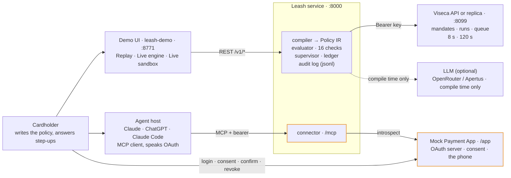
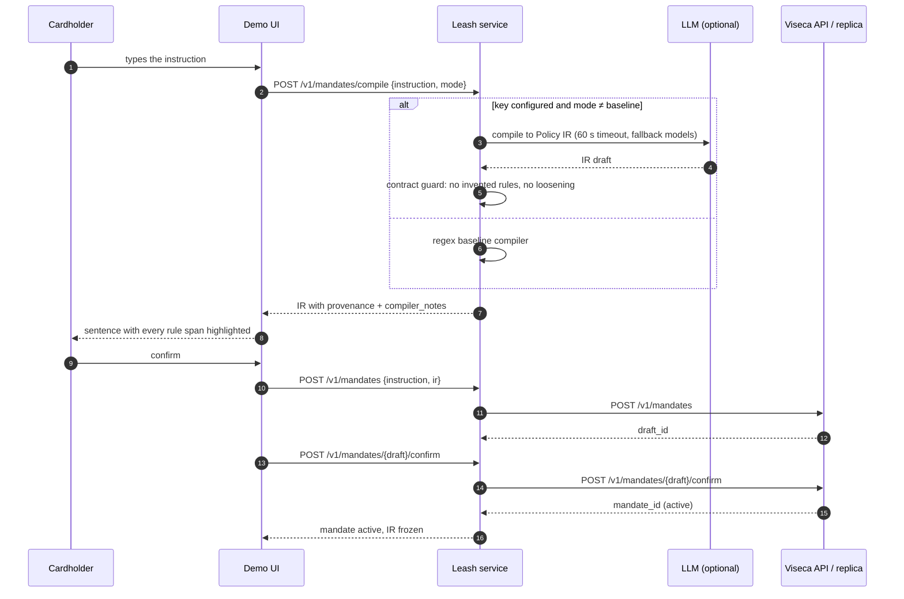
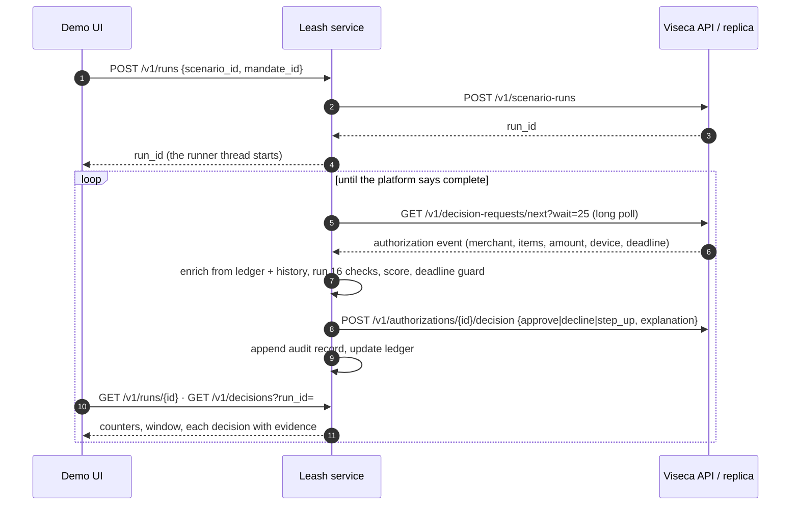
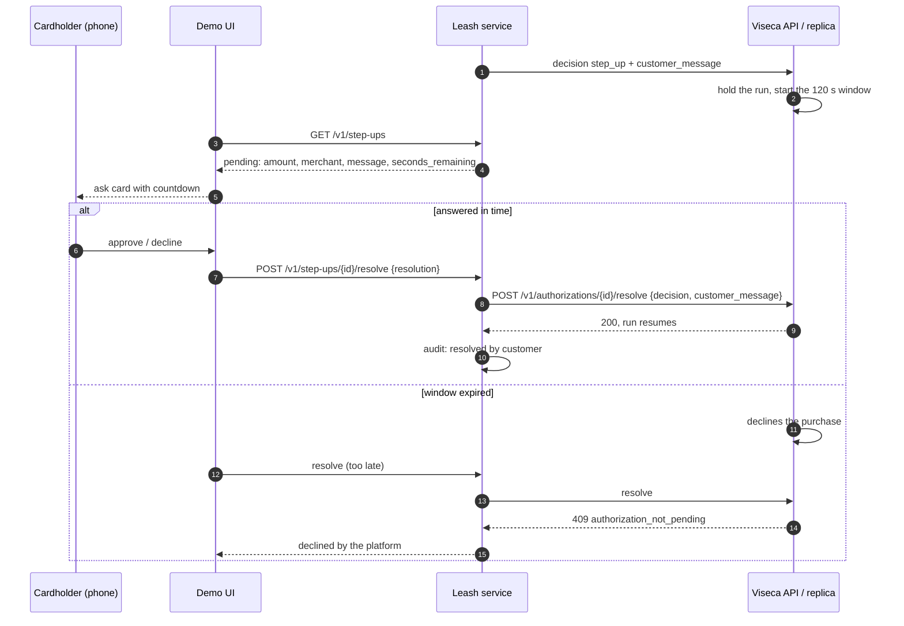
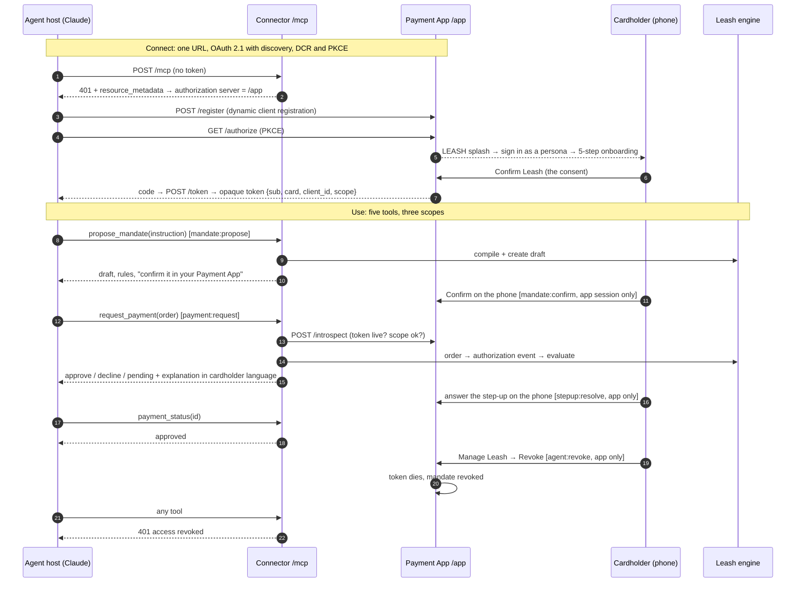

# Leash Architecture

*Agent on a Leash · Viseca challenge · Hack Zurich 2026*

How the three pieces we built, the demo UI, the Leash decision service and the Leash Wallet connector, fit together, who talks to whom, and what happens in each phase from the cardholder's first sentence to a revoked mandate.

**Status:** as built, 25 Sept 2026 (updated for PRs #14–#16: live pack, live instructions) · **Source:** `wallet-control-layer/`, `leash-demo/`, `connector/`

The system answers one question, many times: *may this AI shopping agent spend this cardholder's money on this order?* Every answer is one of `approve` · `decline` · `step_up`, with a plain-language reason and an audit record. We build the control layer; the shopping agent is either Viseca's simulator or a real LLM host plugged in through the connector.

> **The one boundary everything follows.** Only the Leash service talks to Viseca's API and only it holds the team key, the compiled policy, the rolling-window ledger and the audit trail. The UI and the connector are thin clients of that service. One place holds run state, so nothing needs to be kept in sync.

## The components

Three we built, two we plug into. Each runs as its own process on its own port, so they can be deployed and scaled apart, which is what Viseca asked for: the configuration UI belongs in their mobile app, the decision must run in the backend under a strict deadline.

| Component | What it is | Code | Start | Port |
|---|---|---|---|---|
| **Demo UI** | The cardholder's screen and the judges' window · vanilla JS, no build | `leash-demo/` | `./serve.py` | 8771 |
| **Leash service** | The engine · Python 3.12, FastAPI | `wallet-control-layer/src/leash/` | `make serve` / `make serve-live` | 8000 |
| **Leash Wallet connector** | Lets a real agent onto the leash · MCP over HTTP + OAuth 2.1 | `src/leash/connector/`, `payment_app/` | `make connect` | 8010 |
| **Viseca sandbox API / offline replica** | The simulator that proposes purchases · theirs, or our copy of it | Azure (`LEASH_BASE_URL`) · replica in `sandbox/` | `make sandbox` (replica) | 8099 (replica) |

### Demo UI

- Three columns: the agent shopping, the Leash checking each order, the cardholder's phone.
- Shows the instruction with every span that became a rule highlighted.
- Answers step-ups, edits any rule with the blast radius shown before commit.
- Holds **no** API key. Never calls Viseca. Can replay 45 recorded decisions with no engine at all.

### Leash service

- **Policy compiler**: instruction → Policy IR. An LLM may help, once, at authoring time; a regex baseline always can.
- **Evaluator**: 16 deterministic checks, a trust score, a deadline guard under the 8 s budget.
- **Supervisor**: mandates, runs, the ledger of rolling windows, pending step-ups.
- **Audit log**: append-only JSONL, one record per decision with evidence and timing.
- Owns the team key and is the only client of Viseca's API.

### Leash Wallet connector

- MCP server mounted at `/mcp` on the service. Five tools, three scopes.
- Verifies bearer tokens by introspection; maps token → cardholder, card, agent.
- Ships with a **mock Payment App**: OAuth server, consent screen, the phone (confirm, step-up, revoke).
- The agent can propose, request and read. It can never confirm, resolve, amend or revoke: those scopes don't exist for it.

### Viseca sandbox API / offline replica

- Holds mandates, scenario runs and the queue of authorization requests.
- Delivers one proposed purchase at a time by long poll; waits for our decision; enforces the 8 s and 120 s windows.
- The replica in `sandbox/` mirrors it byte for byte so the demo works with no network.

## System map

Solid arrows are HTTP calls at run time. The dashed one is the optional LLM call, made only while a policy is being written, never while a purchase is being decided.

## The flow, phase by phase

Every phase below names who is involved and the exact calls. The UI-driven flow and the connector-driven flow share phases 1 to 4; the connector only changes who proposes the mandate and who requests the payment.

### Phase 0 · Boot and mode

*Involved: UI · Service · Viseca / replica*

1. **The service starts** pointed at one upstream, from the environment. It reads the data pack from `../viseca-2026/data` and compiles the scenario instructions once per compiler mode, cached, so the IR a customer reviews is the IR that is enforced. The repo pack has five scenarios; since 24 Sept the organizers' API serves ten team-specific ones, whose wording defeats the regex ("CHF 250 in any 7-day window" read as a per-order cap), so `make serve-live` warms the model-compiled set at start (about 20 s) rather than behind the Live switch on stage.
   `make serve` → replica · `make serve-live` → Viseca, key from `.env`
2. **The UI asks whether an engine exists.** On load, on pressing Live and whenever the window regains focus. The answer names the upstream, and the header switch shows **Live engine** (replica) or **Live sandbox** (Viseca). No answer means Replay only.
   `GET :8000/healthz` → `{"upstream": {"mode": "replica" | "live"}}`
3. **The UI boots its panels** from the scenario list and the decision configuration: check order, concern weights, the settings catalogue that says which check reads each editable rule. `mode` picks the compiler whose IR comes back: `baseline` by default (instant, deterministic); the demo asks for `auto`, the model when a key is present. A model fallback is served labelled in `compiler_notes` and retried next time.
   `GET /v1/scenarios?mode=auto|baseline|llm` · `GET /v1/config`

### Phase 1 · Authoring: from a sentence to an enforceable mandate

*Involved: UI · Service · Viseca / replica · LLM, optional*

This is the only phase where a language model may run, and it runs once. The output is a reviewable **Policy IR**: hard rules (caps per order and per period, spending hours, merchant requirements), intent facets (what item, what terms) and an uncertainty policy. Every rule carries provenance, the words it came from, so the UI can highlight them and the cardholder can see what will be enforced before agreeing.

The model can only ever add clarity, never permission: the contract guard rejects an IR that invents a rule the instruction doesn't contain or that is looser than the baseline's. Replaying all 45 decisions with model-compiled mandates changes none of them, which is the point.

### Phase 2 · Deciding: the run loop

*Involved: UI · Service · Viseca / replica*

A **run** is one scenario, ten or so proposed purchases, played by the simulator against one mandate. The service pulls each request, decides inside the deadline, pushes the decision back, writes the audit record. The UI never sees the simulator; it watches the service.

1. **Enrich.** The raw event is joined with what the service already knows: approved spend in each rolling window, prior approvals at this merchant and from this device, whether the merchant is a lookalike of a known one, whether this is a duplicate or a re-quote of an earlier order, night hours and weekdays on the cardholder's own clock (Europe/Zurich), and any manipulation patterns found in merchant text. A card with **no history at all**, which is every cardholder on the live API, is judged on this run's approvals instead (`familiarity_basis: run`): the first order at a shop asks (`merchant_history_unavailable`), the customer's yes makes the shop known for the rest of the run, and a device counts as new only against the run's approved orders.
2. **Check.** Sixteen deterministic checks run in a fixed order: per-order and period limits, split orders, merchant permitted / type / lookalike, item matches request, item attributes, unrequested add-on, category exclusion, spending hours, duplicate order, order terms, goal fulfilled, session integrity, manipulation detected. Each returns pass, or a concern with a weight and a sentence.
3. **Combine.** A hard-rule breach is `decline`. Concerns add up to a score; past the threshold the answer is `step_up`, unless the mandate's uncertainty policy says otherwise. Nothing flagged is `approve`. Merchant-provided text is data for the checks, never an instruction. Live instructions added, on 24 Sept, what the pack never asked for: a cap written in EUR, GBP or USD is converted to CHF at compile time and enforced there; a price per night is the stay's cap; a named product no category holds (alcohol) is excluded by keyword; "refundable" is a cancellation term; "never at the weekend" is a spending-days rule. Reason codes for these: `order_not_cancellable`, `cancellation_terms_unknown`, `item_keyword_excluded`, `outside_spending_days`.
4. **Guard the deadline.** The platform gives 8 s. The evaluator decides in about a millisecond; a reserve keeps the answer inside the window even when the upstream is slow, and a decision that could not be delivered is recorded as such (`upstream.submitted`) rather than lost.
5. **Resume safely.** If the service restarts mid-run it rebuilds state from the platform and its own audit trail, so a redelivered event is recognised as the same one and answered idempotently.

### Phase 3 · Step-up: the human in the loop

*Involved: UI · phone · Service · Viseca / replica*

A `step_up` pauses the run on the platform side: nothing more is delivered until the cardholder answers or 120 s pass. This is why the demo shows the agent column freeze exactly where the phone asks. The countdown is the platform's, not the UI's.

An approval is consent to resolve the doubts that were raised, not a blank cheque: the same order, re-proposed, is still checked. The step-up's outcome enters the ledger like any other decision, so a customer-approved CHF 299 counts against the weekly window.

### Phase 4 · Staying in control: tighten, widen, revoke

*Involved: UI · phone · Service · Viseca / replica*

1. **Preferences are a standing layer** above any mandate: "only electronics from shops I've used", "at least 14 days' return window". They outlive the mandate and combine with it; the effective policy is the strictest of the layers.
   `GET/PUT /v1/preferences` · `GET /v1/preferences/candidates` suggests them from the card's own history
2. **Tightening applies at once.** Lowering a cap or narrowing a merchant list is patched through to the platform and re-evaluated against the run's pending state. The UI shows the blast radius first: which of the run's orders would change decision.
   `POST /v1/mandates/{id}/amend` → `PATCH /v1/mandates/{id}` upstream
3. **Widening is only proposed.** A looser rule is never applied by the service on its own; it comes back as a proposal the cardholder must confirm, the same path as phase 1. A request that loosens the uncertainty policy is refused with `422`.
4. **Revoke ends everything.** The mandate is deleted upstream, the run stops, every pending step-up is declined, and the audit trail says why.
   `DELETE /v1/mandates/{id}` → `DELETE /v1/mandates/{id}` upstream

### Phase 5 · A real agent on the leash: the connector

*Involved: Agent host · Connector `/mcp` · Payment App · Service*

Everything above assumed Viseca's simulator proposes the purchases. The connector replaces the simulator with a real agent, Claude or ChatGPT, and replaces the demo UI with the mock Payment App as the cardholder's phone. The engine underneath is untouched: an agent's order becomes the same authorization event, judged by the same 16 checks, in the same Supervisor tables, so the phone's step-up and activity screens see it.

| Tool | Scope | Backed by | Returns |
|---|---|---|---|
| `propose_mandate` | `mandate:propose` | `POST /v1/mandates` | draft id, compiled rules with provenance, waiting for the cardholder |
| `whats_allowed` | `activity:read` | mandate + ledger | active rules in plain language, remaining budget, hours |
| `request_payment` | `payment:request` | `POST /v1/decide` | approve / decline / pending, explanation, trust score |
| `payment_status` | `payment:request` | step-ups + audit | resolved decision, or seconds left |
| `recent_activity` | `activity:read` | `GET /v1/decisions` | the last N decisions as the cardholder reads them |

The scopes the agent can never hold, `mandate:confirm`, `stepup:resolve`, `mandate:amend`, `mandate:revoke`, `agent:revoke`, exist only for the app's own session. That is what makes the consent sentence, *"Claude can never approve its own requests, confirm a mandate, or change your limits"*, true by construction. Step-ups stay out of band on purpose: MCP could ask the agent to ask the user, but then the agent would mediate the question. Tokens are checked by introspection rather than as signed JWTs so that Revoke is immediate: the token dies at its source and the agent's next call is a 401.

## Three ways to run it

The header switch in the demo UI names what the engine is pointed at. The engine's own health endpoint is the source of truth.

| Mode | Engine | Upstream | Start | When |
|---|---|---|---|---|
| **Replay** | none | none | `./serve.py` only | Always works. 45 recorded decisions. The fallback if the venue Wi-Fi dies. |
| **Live engine** | `:8000`, `mode: replica` | replica `:8099` | `make sandbox` + `make serve` | Real decisions in real time, fully offline. Same 45 answers as the baseline. |
| **Live sandbox** | `:8000`, `mode: live` | Viseca API (Azure) | `make probe-live` then `make serve-live` | The real platform: ten team-specific scenarios, one run per team at a time, a pending step-up holds the whole queue. Every cardholder there has no history, so expect about two step-ups per scenario and answer them on the phone. Rehearsed 25 Sept: all ten, 111 decisions, 29 answers, every run completed. |
| **Connector** | `:8010` | replica, or Viseca with `--live` | `make connect` | A real agent through `/mcp`; the phone at `/app/`. Its own port so it runs beside the others. |

## Design principles the flow enforces

- **Decoupled by contract.** The UI ↔ engine HTTP contract is a spec and a Postman collection; either side can be replaced. Viseca can drop the engine behind their app.
- **No model in the decision path.** The LLM compiles policy, once, and can be absent. Decisions are deterministic rules over facts, so they are explainable, fast and reproducible.
- **Predictable under failure.** Model down → baseline compiler. Upstream slow → deadline guard. Service restart → resume from audit. Wi-Fi gone → replica and Replay.
- **Merchant text is untrusted.** Item names, descriptions and messages feed the manipulation check as data. An injection corpus in the tests keeps it that way.
- **Nothing hard-coded.** No decision depends on scenario name, request id or position; a test asserts it. The same engine judges the pack's personas and a real agent's orders.
- **Consent never passes through the agent.** Confirm, resolve, amend, revoke belong to the cardholder's session only, in the UI and in the connector's scopes alike.
- **Every decision explains itself.** One audit record per decision: policy in force, evidence considered, checks that fired, timing, whether the platform received it.
- **State lives in one place.** The service owns the ledger, runs and step-ups. The UI and the connector read; the platform is the clock.

*Built from `wallet-control-layer/specs/` (decision-rules, service-contract, policy-ir, llm-compiler, connector), the component READMEs and the code as of 25 Sept 2026. Normative source for decision semantics: `specs/decision-rules.md`. The styled original of this page is [Leash Architecture.html](Leash%20Architecture.html).*
